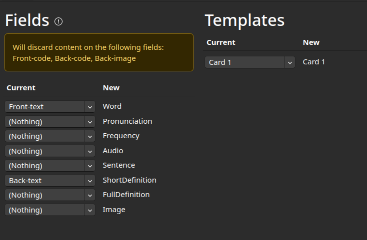
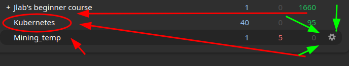
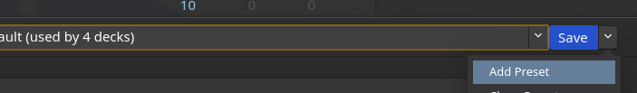
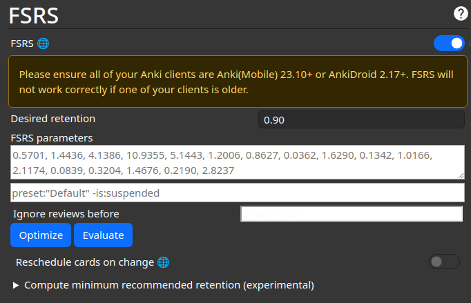
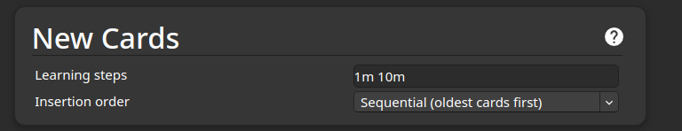
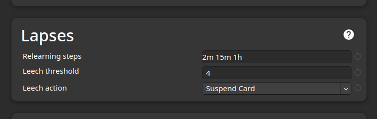
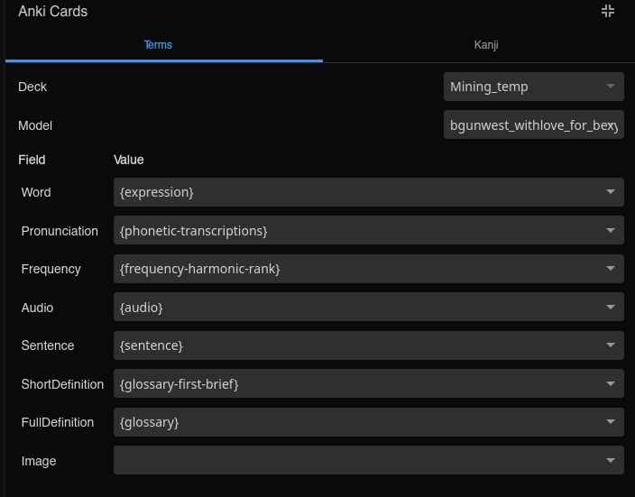

# Anki

Я не нашёл нормальных карточек в инете поэтому сгенерил сам через ии
вот этот ебать ахуенный темплейт: [bigguns_for_bexoy_withLOVE333.apkg](https://github.com/misuzu1flv/yomitan_guide/blob/main/assets/bigguns_for_bexoy_withLOVE333.apkg)

После запуска в анки добавится колода с новым типом карт, колоду можно удалить.
При добавлении карточек далее нужно будет указывать этот темплейт.

## Миграция старых карточек

В колоде могут находится карты с разными типами, но при желании можно их свести к одному

В card browser нужно выбрать нужные карт (например по колоде или по типу карты), затем нажать
> Notes(слева сверху) -> Change card type

> !!! Осторожно можно проебать данные,
> если не хочется ВДРУГ проебать данные в настройках анки можно сделать бекап коллекции !!!

В меню нужно выбрать новый тип карточки, в который мы будем мигрировать (bgunwest_withlove...),
и выбрать какие поля будут соответствовать каким примерно так:


### Дополнительно

Можно также всем старым карточкам добавить аудио, я этим сам не занимался но вот первый
запрос в гугле: [reddit](https://www.reddit.com/r/Anki/comments/pllr7g/comment/hcbhehx/?utm_source=share&utm_medium=web3x&utm_name=web3xcss&utm_term=1&utm_content=share_button) 

## Настройка колоды
Тык туда:

Добавляем новый пресет для колоды:

### Включаем FSRS 
(алгоритм пизже дефолтного)


Тут важным параметром является Desired retention от него очень сильно зависит число review, по сути алгоритм будет рассчитывать показ карточек так, чтобы твой retention (это число определяет процент карточек которые ты вспоминаешь с первого раза) был равен этому числу. Выше 90 лучше не ставить, нормально даже 75-80.

### Также важные настрйоки (мне было в падлу тут писать можешь погуглить про них)


- learning steps -- через какие интервалы будут показываться НОВЫЕ карты, я юзаю (30s 1m 5m 1h), это означает что для того чтобы New карта перешла в состояние не  new нужно повторить ее 4 раза с такими интервалами (советую поставить чето подобное)


- тут relearning steps -- тоже самое что для новых, интервалы для проебанных карточек
- leech freshold -- сколько раз можно проебать карточку перед тем как она либо исключится из колоды, либо анки ее отметит, в зависимости от leech action

## Полезные аддоны 

- [AJT Flexible Grading](https://ankiweb.net/shared/info/1715096333) -- управление клавиатурой + убирает кнопку good, можно отвечать без переворота, короче почитать описание
<details>
    <summary> Мой конфиг для аддона AJT </summary>

```
{
    "buttons": {
        "again": "h",
        "easy": "l",
        "good": "k",
        "hard": "j",
        "last_card": ":",
        "undo": "u"
    },
    "color_buttons": false,
    "colors": {
        "again": "FireBrick",
        "easy": "DodgerBlue",
        "good": "ForestGreen",
        "hard": "DarkGoldenRod"
    },
    "flexible_grading": true,
    "hide_card_type": false,
    "pass_fail": true,
    "press_answer_key_to_flip_card": false,
    "prevent_clicks": false,
    "remember_zoom_level": true,
    "remove_buttons": false,
    "scroll": {
        "down": "Shift+J",
        "left": "Shift+H",
        "right": "Shift+L",
        "up": "Shift+K"
    },
    "scroll_amount": 100,
    "set_zoom_shortcuts": true,
    "show_last_review": true,
    "tooltip_on_zoom_change": true,
    "zoom_states": {}
}
```
</details>

- [advanced browser](https://ankiweb.net/shared/info/874215009) 

# Yomichan setup

В настройках включить advanced режим
и желательно английский


## Словари

### Установка словарей

> Dictionaries -> Configure Installed and enabled dictionaries...

Там кнопка install, туда перетаскивать архивы из сылок ниже

### Словари

- EN-RU
    1. kty-en-ru -- Словарь с wiktionary -- [качать](https://github.com/yomidevs/kaikki-to-yomitan/releases/latest/download/kty-en-ru.zip)
- EN-EN
    1. **Oxford Advanced Learner's Dictionary**** --
    [качать](https://github.com/MarvNC/yomichan-dictionaries/files/14957647/oald-release-yomitan.zip)
    2. kty-en-en -- его по умолчанию рекомендует при установке английского но можно и 
    [скачать](https://github.com/yomidevs/kaikki-to-yomitan/releases/latest/download/kty-en-en.zip)

**Oxford Advanced Learner's Dictionary при установке надо разархивировать,
в папке будет много разных словарей

Нужно выбрать один из двух словарей:
`dict-oald` и `dict-oald-extra`, в extra словаре к определениям добавлены идиомы и проч.
подробнее в файле `1-instructions.txt`

Из этого же архива нужно установить `dict-oald-freq` и `dict-oald-ipa`,
для частот употребления и транскрипций соответственно

Также этот архив содержит кастомный CSS для внешнего вида словарика, для установки нужно скопировать содержимое файла `2 - custom css.txt` полностью в  
> Appearence -> Configure custom CSS... -> Pop up CSS

После установки всех словарей список словарей выглядит примерно так:

Порядок словарей в этом меню определяет то,
в каком порядке они вылазить будут при использовании yomitan.
При настройке как на скрине первым будет по возможности kty-en-ru (RU-RU), 
затем  oald (пиздатый EN-EN), затем  kty-en-en (EN-EN похуже но с большим покрытием).

> Имхо тут можно вообще без англо-русского обойтись и пользоваться только двумя
англо-английскими, они пиздатые и я чекал по википедии покрывают примерно всё.


###  Другие словари

Если чето не нравится можно посмотреть еще другие словари по ссылкам ниже,
но имхо мне те что выше показались достаточными.
Нормальных полноценных русско-английских словарей переделанных под анки я в инете не нашёл,
а при конвертации получается нечитаемое месиво.

По аналогичной причине хоть я и нашёл словари оксфордские и кембриджские (EN-EN) итд под анки конвертнутые я выбрал словарь единственный нормально под формат анки переделанный oald. 

- [yomitan-dictionaries][1] -- База словарей огромная с разных языков 
Из интересного там есть apple словари (en-ru, en-en), все модные самые EN-EN словари типо оксфорда кембриджа итд.
- [kaikki-to-yomitan][2] -- экспорты словарей wiktionary для разных языков

И тут прочие ссылки полезные  если вдруг конвертацией хочется заняться:

<details closed>
    <summary>Ссылки</summary>

- [pyglossary](https://github.com/ilius/pyglossary) -- Утилита для конвертации словарей (поддерживает миллион форматов в т.ч. и yomitan)
- [dicto.org.ru/xdxf.html](http://dicto.org.ru/xdxf.html) -- Большой старый список словарей в xdxf
- [yomitan-import](https://github.com/yomidevs/yomitan-import) -- Оффициальная йомитян утилита для импорта 
- [yomitan-wikipedia](https://github.com/MarvNC/wikipedia-yomitan) -- Wikipedia в йомитяне
- [yomichan-dict-builder](https://github.com/MarvNC/yomichan-dict-builder) -- тут много ссылок на приколы в т.ч. инструмент для конвертации vndb персонажей в анки словарик

</details>


## Дружим Anki с Yomitan 

> Anki -> Enable Anki intergration

> Anki -> Configure Anki Format...

`Deck` -- нужная колода

`Model` -- которую поставили ранее

Настройки маппинга настраивать как на картинке



Чисто теоритически можно еще поиграть с ShortDefiniton и FullDefinition 
(По умолчанию первое поле содержит короткое определение из первого словаря доступного,
а второе поле вообще все определения)

На этом впринципе настройку можно закончить

## Полезные прочие настройки

### Сканировать слова внутри самого йомитяна
> Popup behaviour -> Allow scanning popup content 

`Maximum number of child popups` -- для оптимизации чтоб слишком дохуя не открывать

Полезно при использовании EN-EN словарей можно проваливаться в слова которые вы не знаете в определении других слов

Пример:


### Frequency sorting словарей
> Dictionaries -> Frequency sorting dictionary

Если указать в этом поле частотный словарь (`yzk-freq-en-v3` из установки выше)
и поставить `sort: rank based`,
то порядок вывода словарей будет зависеть не от порядке в менюшке из install, 
а от frequency rank результата 
> Могут вверх вылезать хуесосы некрасивые ХЗ попробовать можно

### Прочее рандом
- Можно перебиндить на кнопку мышки если геймерские кнопочк есть или 
на колесико кнопку для скана, так можно одной рукой браузить

- Если долго звук качается можно установить локальный аудио сервер (тут должна быть ссылка)

## Интеграция с сервисами
### Google docs
Для работы в гугловой хуйне надо врубить
> Accessibility -> Enable Google Docs compatibility model

Может не работать
<details closed>
    <summary> Пояснение с Yomitan </summary>
 Google Docs now uses canvas-based rendering to display content[2] which prevents Yomitan from being able to scan text using the standard methods. Enabling this option will force Google Docs webpages to expose some additional text information which should allow Yomitan to still work.

If any profile has this setting enabled, compatibility mode will be activated; profile conditions are ignored.

Google has changed this compatibility implementation several times, and the changes do not seem to be announced or documented. Therefore, it is possible that this feature could stop working at any time the future without warning
</details>

### Локальные файлы (PDF)

Для доступа  к локальным файлам надо выдать права расширению (на доступ к локальным файлам),
зависит от браузера -> gogole.

К сожалению с PDF может не работать (у меня не работает), 
в таком случае можно воспользоваться онлайн PDF просматривалками, например 
https://yomitan.wiki/yomitan-pdf-viewer/web/

Чисто теоретически можно поменять автозапуск пдфок как-то перенаправлять на сайт мб расширением каким-то

[1]: https://github.com/MarvNC/yomitan-dictionaries#other-languages
[2]: https://github.com/yomidevs/kaikki-to-yomitan/blob/master/downloads.md

# Ресурсы

Тут прям дохуя ресурсов очень полезных по изучению языков и по инструментам, 
но фокус в них на японский:
- [the-moe-way](https://learnjapanese.moe/)
- [animecards](https://animecards.site/)
- [jp-mining-note](https://arbyste.github.io)
